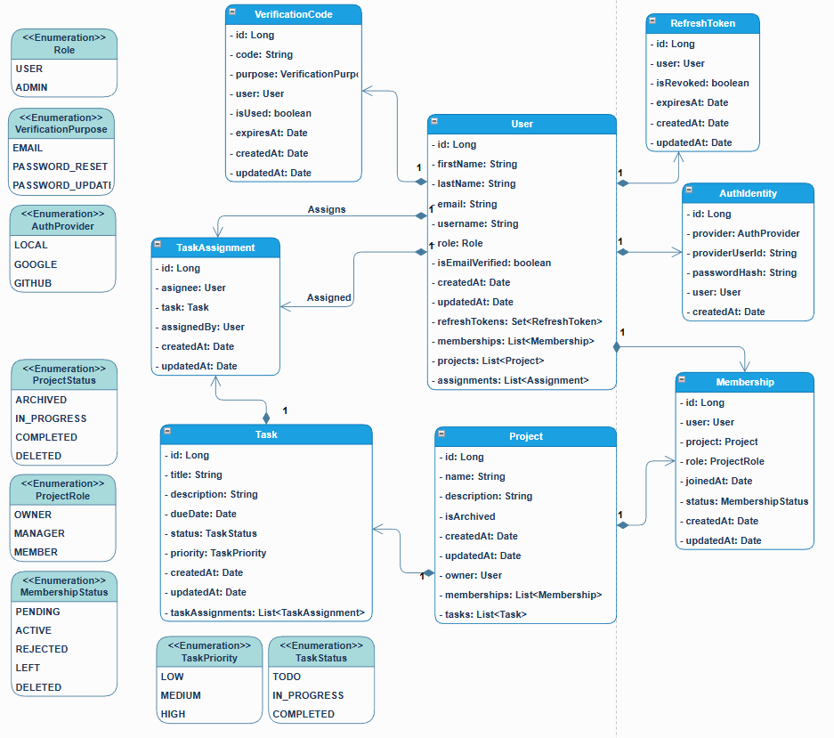

# Project Management Backend

A clean, production-ready Spring Boot backend powering a project management application. It focuses on robust authentication, clear domain boundaries, and maintainable architecture.

---

## Overview

This service provides core backend capabilities for a project management platform:

- User registration with email or OAuth 2.0. Login with JWT authentication and refresh tokens
- Email verification workflow (pluggable email proxy, Gmail integration)
- OAuth 2.0 (OIDC) with Google as IdP
- Project and membership lifecycle with access control policies
- Task and assignment models to capture work and ownership
- Global error handling for predictable API responses

The codebase is organized with a classic layered architecture (controller → service → repository → model) alongside a dedicated `security` module and policy checks that keep business rules explicit and testable.

---

## Class Diagram

## Tech Stack

- **Language:** Java (Maven as built tool)
- **Framework:** Spring Boot, Spring Security
- **Data Layer:** Spring Data JPA with Hibernate
- **Caching/State:** Spring Data Redis (e.g., token blacklist, ephemeral data)
- **Auth:** JWT access + refresh tokens, token blacklisting
- **OAuth:** OAuth 2.0 / OIDC login with Google
- **Email:** Pluggable email proxy (Gmail proxy implementation)
- **Configuration:** YAML + environment variables
- **Containerization:** Docker Compose for local dependencies (e.g., database)

---

## Key Features

- **Authentication & Tokens:** Login issues short-lived JWT access tokens backed by a refresh token; refresh/blacklist logic protects sessions.
- **Email Verification:** Verification codes via a proxy interface with a Gmail implementation for sending emails.
- **Projects & Memberships:** Domain models for `Project`, `Membership`, `Task`, and `TaskAssignment` with clear repositories/services.
- **Policies:** Explicit `MembershipPolicy` and `ProjectPolicy` to guard state transitions and permissions.
- **Error Handling:** Centralized `GlobalExceptionHandler` and domain-specific exceptions for clean error responses.
- **DTOs & Converters:** Request/response DTOs and converters (e.g., Project status filter) for clean API contracts.
- **Google OIDC Login:** OAuth 2.0/OpenID Connect integration to authenticate via Google, streamline onboarding, and align with modern identity standards.
- **Redis-backed Controls:** Fast token blacklisting and ephemeral state storage using Redis to support secure logout and session invalidation.

---

## Architecture

- **Controllers:** Define REST endpoints and orchestrate requests/responses.
- **Services:** Encapsulate business logic (auth, projects, memberships, tokens).
- **Repositories:** Spring Data interfaces for persistence of domain models.
- **Models:** Core entities (`User`, `Project`, `Task`, etc.) with enumerations.
- **Security:** Configurations, handlers, JWT helpers, OAuth hooks, and user details.
- **Policies:** Business rule enforcement for roles and state transitions.
- **Proxy:** Abstraction layer for external services (e.g., email providers).
- **Redis Integration:** Used by security/services for token blacklist and short-lived data.

---

## API Highlights

While endpoint details evolve, common patterns include:

- **Auth:**
  - `POST /api/auth/register` — create account and send verification code
  - `POST /api/auth/login` — obtain access and refresh tokens
  - `POST /api/auth/refresh` — rotate access token using refresh token
  - `POST /api/auth/logout` — invalidate/blacklist tokens
- **Projects:**
  - `POST /api/projects` — create a project
  - `GET /api/projects` — list projects (with status filters)
  - `GET /api/projects/{id}` — fetch a project
  - `PUT /api/projects/{id}` — update a project
- **Memberships:**
  - `POST /api/projects/{id}/members` — add/invite member
  - `GET /api/projects/{id}/members` — list members

---

## Configuration

- **application.yml:** Central application configuration (ports, security, email, etc.).
- **.env:** Secrets and environment-specific overrides; a `.env.example` is provided.
- **Docker Compose:** Spins up local dependencies so the app can run without manual setup.
- **Redis:** Configure Redis connection details for token blacklist and ephemeral state.
- **Google OAuth:** Client ID/secret and allowed redirect URIs for OIDC flows.

---

## Repository Structure (high-level)

- `controller/` — REST API endpoints
- `service/` — business logic
- `repository/` — persistence interfaces
- `model/` — domain entities and enums
- `security/` — auth, config, handlers, JWT/OAuth helpers
- `policy/` — access and state transition rules
- `proxy/` — external service integrations (email)
- `dto/` — requests, responses, converters
- `exception/` — domain and global exception handling

---

## Engineering Highlights (for Recruiters)

- **Maintainable Architecture:** Clear separation of concerns with well-defined layers.
- **Security-First:** Robust JWT auth with refresh + blacklist; centralized security utilities.
- **Explicit Business Rules:** Policies make authorization and state transitions transparent and testable.
- **Integration Abstraction:** Proxy pattern decouples external services (e.g., email) from core logic.
- **Developer Experience:** Maven wrapper, Docker Compose, and structured DTOs speed onboarding.

---

## Roadmap

- Role-based authorization expansion
- Comprehensive OpenAPI/Swagger documentation
- CI pipeline and test coverage expansion
- Additional providers (email/SMS) and secrets management

---

## Notes

- This repository uses the Maven wrapper (`mvnw`, `mvnw.cmd`) so contributors can build without installing Maven globally.
- If Gmail integration is used, ensure credentials are properly set and allowed by your provider.
